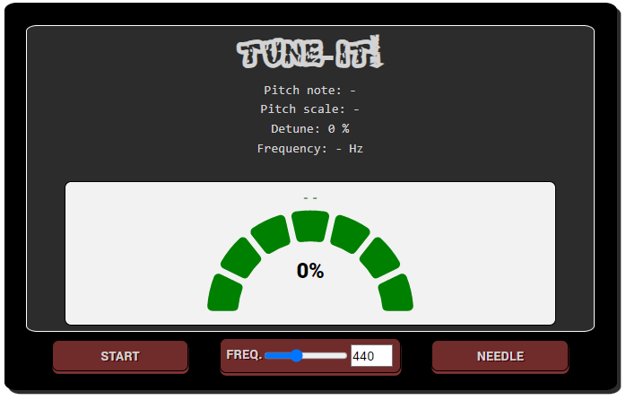

# Tune it

A very simple online instrument tuner

# Online demo

https://tune-it-leoemvee.vercel.app/

# To run locally

- `npm i`
- `npm start`

# How to use (see also instructions link in the app)

- Press `start` button on the left bottom to activate the mic and begin tuning. Press `stop` button to stop the audio recording.
- Use the slider or the input field below the meter to select the reference frequency (from 400 to 509 Hz).
- Press the button on the right bottom to toggle between different meter views (percent, needle and note character).

# Tech stack

- React / JS / CSS / Bootstrap

# Thanks to

- [Chris Wilson](https://github.com/cwilso), for [PitchDetect](https://github.com/cwilso/PitchDetect).
- [Martin36](https://github.com/Martin36), for [react-gauge-chart](https://github.com/Martin36/react-gauge-chart).
- [Adrià M. Cassorla](https://github.com/adriamcassorla), for his technical support.

# To do

- Test app with high performance equipment and make the necessary adjustments from there.
- Develop native version.
- Any other suggestions are more than welcome.
